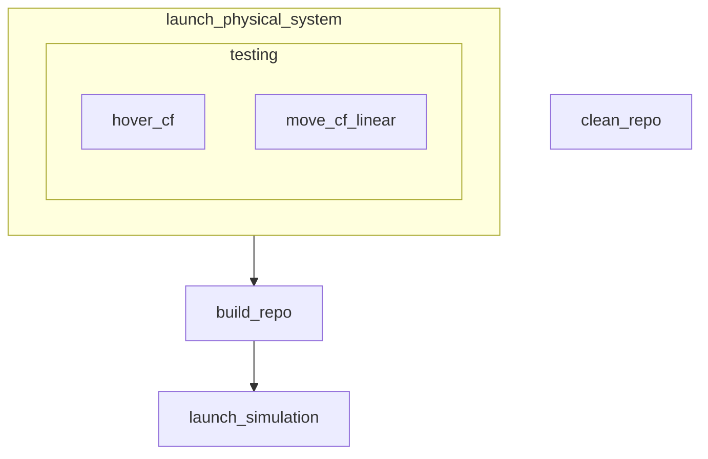

# Bash Scripts

```mermaid
graph TD
    build_repo
    clean_repo
    build_repo --> launch_simulation
    subgraph launch_physical_system
        subgraph testing
            hover_cf
            move_cf_linear
        end
    end
    launch_physical_system --> build_repo  
```